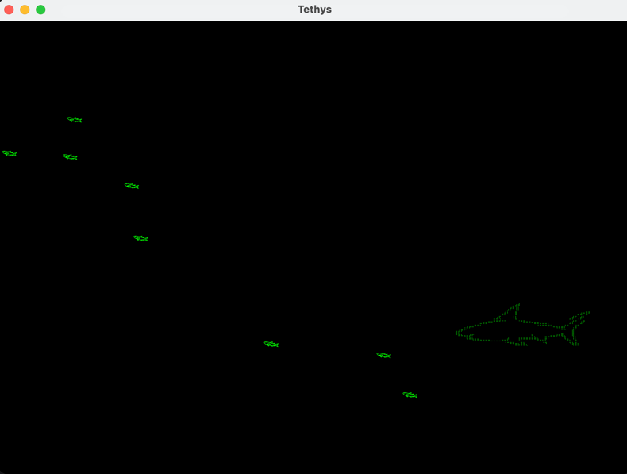
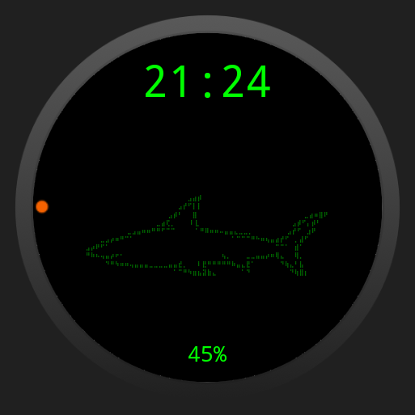

<p align="center">
  <a href="#-features">Features</a> •
  <a href="#-previews">Previews</a> •
  <a href="#-architecture">Architecture</a> •
  <a href="#-building">Building</a> •
  <a href="#-tech-stack">Tech Stack</a>
</p>

<h1 align="center">🦈 Tethys — ASCII Shark</h1>

<p align="center">
  <b>Tethys</b> is a cross-platform ASCII shark aquarium built with Kotlin Multiplatform + Compose Multiplatform.
  The shark swims, eats fish, and idles across your phone, desktop, and wrist.
</p>

---

## Previews

<table align="center">
  <tr>
    <td align="center" width="33%">
      <strong>📱 Phone</strong>
      <br><br>
      
      <br>
      <video src="resources/android_prev_1.mp4" width="90%" controls muted loop playsinline></video>
    </td>
    <td align="center" width="33%">
      <strong>🖥️ Desktop</strong>
      <br><br>
      
      <br>
      <em>Desktop shares the same Compose UI</em>
    </td>
    <td align="center" width="33%">
      <strong>⌚ Wear OS</strong>
      <br><br>
      
      <br>
      <video src="resources/wear_prev_1.mp4" width="70%" controls muted loop playsinline></video>
    </td>
  </tr>
</table>

---

## Features

- **Swimming shark** — sinusoidal undulation with two-frame animation creates a fluid swimming illusion
- **Hungry predator** — chase and eat little fish with AABB collision detection; fish respawn at random edges
- **Bite mechanics** — the shark opens its mouth when it catches a fish or when you tap it
- **Braille mirroring** — hand-rolled `mirror()` extension swaps Braille dots to flip the shark left/right
- **Watch face** — idle shark with time & battery on Wear OS, dims to ambient mode
- **Three platforms** — single shared codebase targets Android, Desktop JVM, and Wear OS

## Architecture

```
Tethys
├── :shared                  # KMP library (androidTarget + jvm)
│   └── commonMain
│       ├── feature/tethys/  # TethysViewModel, TethysUiState, TethysScreen
│       ├── ui/screen/characters/  # Shark, LittleFish, BrailleUtils
│       └── ui/theme/        # TethysTheme, Color, Type
│
├── :composeApp              # KMP app (Android + Desktop entry points)
│   ├── androidMain/         # MainActivity, TethysApp (Koin)
│   └── desktopMain/         # Main.kt (Koin + Compose window)
│
└── :wearApp                 # Android-only Wear OS app
    └── src/main/
        ├── TethysWatchFaceService  # CanvasRenderer2 watch face
        └── WatchFaceActivity      # Compose idle preview
```

**Three modules. One shared core.** All game logic, state management, ASCII art, and themeing live in `:shared`. Platform modules only provide entry points and platform-specific rendering.

## Building

```bash
# Phone
./gradlew composeApp:assembleDebug

# Desktop
./gradlew composeApp:run

# Wear OS
./gradlew :wearApp:assembleDebug
```

> **Wear OS note:** The watch face targets SDK 33 to bypass Wear OS 5's Watch Face Format enforcement for programmatic `WatchFaceService` implementations.

## Tech Stack

| Layer | Choice |
|-------|--------|
| Language | Kotlin 2.4 |
| UI | Compose Multiplatform 1.11.1 |
| DI | Koin 4.2.1 |
| Architecture | MVI (TethysViewModel → TethysUiState → TethysScreen) |
| Wear renderer | CanvasRenderer2 + Canvas.drawText |
| Build | Gradle + AGP 9.2.1 + KMP plugin |
